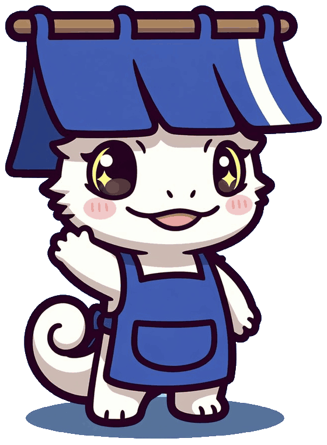

# 紙芝居 / kamishibai

**説明を、1枚ずつ送るためのキット。**
リンク1本で渡せる、スマホで読める、ガイド役が横から解説してくれるウォークスルーを作ります。

<p></p>

長い文書は読んでもらえません。とくに**忙しい相手に、前提から順に揃えてもらいたいとき**——
新しい仲間のオンボーディング、企画の共有、機能の紹介。そういうときのためのものです。

- **1枚のHTML**になります。サーバーも、ビルド設定も、CDNも要りません
- **音源ファイルなしで音が鳴ります**（Web Audio でその場で合成）
- **ガイドのキャラクター**が吹き出しから身を乗り出して解説します。つつくと星が散ります
- **左右スワイプで送れます。**指について画面が少し動き、端では重くなります
- スマホ前提。iPhone のセーフエリアまで見ています
- `prefers-reduced-motion` を尊重します

---

## つかう

```bash
git clone <このリポジトリ>
cd kamishibai
cp content/example.js content/mine.js     # コピーして
$EDITOR content/mine.js                   # 書き換えて
node build.mjs content/mine.js            # ビルドする
open dist/mine.html
```

Node さえあれば動きます（依存パッケージ 0）。できた `dist/mine.html` をそのまま送ってください。

**まず [`content/example.js`](content/example.js) をビルドして開いてみてください。**
紙芝居の使い方が、紙芝居で説明されます。

---

## 1画面 = 1オブジェクト

```js
{
  ch: 1,                        // 何章目か（上のバーの区切り）
  tag: '市場は大きい',           // 左上の見出し。このページで何を伝えたいか
  talk: `<b>ここが解説です。</b>主語のある文章で書きます。`,
  html: K.sys('前提①') +
        K.head('切り抜きは、<em>すでに経済圏。</em>') +
        K.cards([{ k:'規模', v:'1,050億円', d:'国内VTuber市場（2024年度）' }]),
}
```

**`tag` が一番大事です。** ここが決まらない画面は、たいてい内容も決まっていません。

章の扉は `cover` を使います。

```js
{ ch: 1, tag: '土台', cover: { num:'1', title:'土台', sub:'いま何が起きているか' } }
```

詳しい書式は [`docs/content.md`](docs/content.md)。

---

## 部品

| | |
|---|---|
| `K.head(html)` | 大見出し。`<em>` で青、`<span class="o">` で橙、`<span class="r">` で赤の縁取り |
| `K.lead(html)` / `K.tiny(html)` | 本文 / 小さい注記 |
| `K.who({name,initial,color,note})` | 誰の視点かを示す札 |
| `K.sys(text)` | 人ではなく仕組みの説明 |
| `K.cards([{k,v,d,color}])` | 横に並ぶカード。順に跳ねて出ます |
| `K.nums([{count,label,tone}])` | 大きい数字。`count` でカウントアップ |
| `K.ask(tag, question, items)` | 黄色い吹き出し。相手に考えてほしいところ |
| `K.quote(text, cite)` | 引用 |
| `K.memo(html)` | 補足のかたまり |
| `K.pill(text, tone)` | 小さいラベル（`yes` / `no` / `gd`） |
| `K.goals([{title,body,color}])` | 番号つきの目標 |
| `K.todo([{title,body,link}])` | 行動導線。`link` を付けるとカードごとリンクになる |
| `K.callout(html)` | 黄色い大きな締め |
| `K.rule()` | 区切り線 |

`html` はただの文字列なので、足りなければ生のHTMLを書けば通ります。
画面固有のCSSは `content/<名前>.extra.css` に置くと自動で読み込まれます。

---

## ガイドのキャラクター

```js
guide: { still: '@@assets/guide.png@@', loop: '@@assets/guide-loop.mp4@@' }
```

- `still` … 背景を抜いたPNG。吹き出しから飛び出す大きい絵
- `loop` … 丸ボタン用の短い動画（省略可。無ければ ◆ が出ます）

引用符で囲んだ `@@パス@@` は、**ビルド時に data URI として埋め込まれます。** だから1枚で完結します。

### 背景を抜く

```bash
tools/cutout.sh 元画像.png 0x92C4EF 560
```

単純な色抜きだと、**キャラの中にある「背景に近い影の色」まで抜けて穴が開きます**（眉間や首の影がよくやられます）。
このスクリプトは外周から辿れる透明だけを背景とみなし、**辿り着けない透明＝内側の穴を埋め戻します。**

確認用にマゼンタ合成した画像も出します。**白い背景で確認すると抜けが見えません。必ずマゼンタのほうを見てください。**

---

## 音

音源ファイルはありません。正弦波を4音ずらして鳴らし、最後に三角波を1.2秒かけて減衰させています。
それが「キラリラリーン」の余韻です。周波数は `src/kamishibai.js` の `SEQ` にあります。

`sound: false` で切れます。画面右上の 🔊 でも切り替えられます。

---

## 中身

```
build.mjs              1枚のHTMLを組み立てる（依存なし）
src/
  kamishibai.css       デザイン
  kamishibai.js        エンジン。触らなくてよい
  shell.html           骨組み
content/
  example.js           使い方を説明するサンプル
tools/
  cutout.sh            背景を抜いて内側の穴を埋める
```

## 著作権

**Copyright (c) 2026 kou. All rights reserved.**

このリポジトリは公開していますが、**ライセンスは付与していません。**
閲覧と、GitHub 上での fork（GitHub 利用規約の範囲）以外の利用 —— 複製・改変・再配布・商用利用 —— は許諾していません。

使いたい場合は声をかけてください。
ガイドのキャラクター画像（`assets/`）も同様です。
